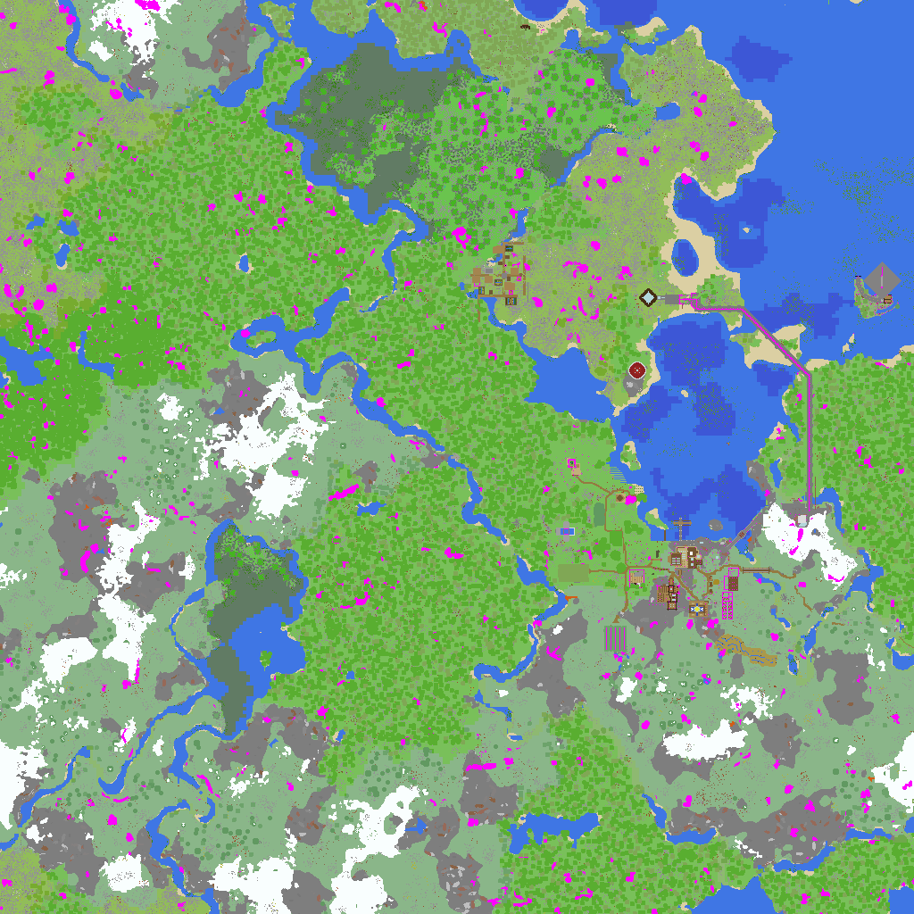

# fastnbt

Documentation: [docs.rs](https://docs.rs/crate/fastnbt)

A fast (or trying to be!) parser for *Minecraft: Java Edition*'s NBT and Anvil formats.

The `anvil` binary can render your world leveraging all of your CPU. On a Ryzen 3600X 6-core, with a reasonably complex world, it can render a map of 256 *regions* in under 10 seconds. That's about 30k chunks every second.

```bash
anvil render ~/path/to/world-dir # render entire overworld
anvil render ~/path/to/world-dir --dimension=end # render entire end
anvil render ~/path/to/world-dir --size=6,6 # render 6 by 6 regions around 0,0.
anvil render ~/path/to/world-dir --size=10,10 --offset=-4,10 # render 10 by 10 offset by x: -4, z: 10.
```



## TODO

* Full palette for block-based world rendering (unknown blocks are magenta at the moment)
* Modify palette colour based on height.
* Modify palette colour based on biome.
* Change to visitor-based parser to avoid allocation of Array tags when not needed.
* Test on Windows.
* Use newtypes idiom for the various co-ordinate types for safety.
* serde for deserialisation.
* Maybe: some sort of interactive map. WASM?
* Maybe: transparent blocks.

### Full palette

Inside `.minecraft/versions` you can find JARs for each local Minecraft versions. If you unzip these you can find `assets/minecraft/blockstates/` which look to describe every placeable block. They refer to models in `asserts/minecraft/models/`, that refer to textures that can be found in `assets/textures/`. Should be able to use this to precompute a palette for all blocks.

## Usage

For the library

```toml
[dependencies]
fastnbt = "0.4.0"
```

For the `anvil` executable

```bash
cargo install fastnbt-tools
```
